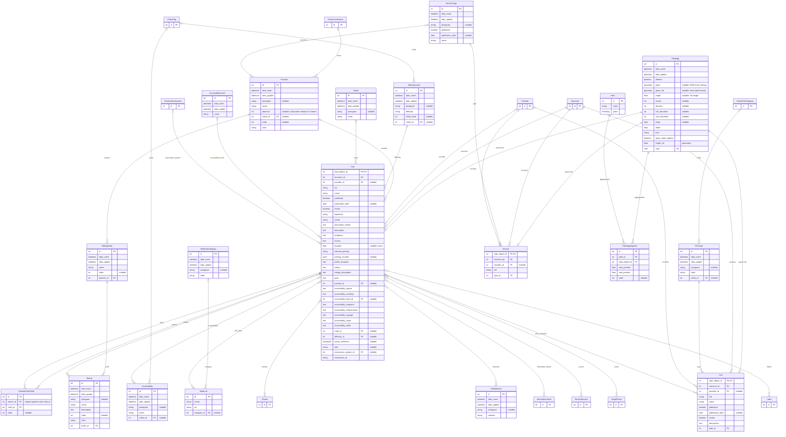

## Example Database Schema

```mermaid
erDiagram
    %% Model-level schema extracted from GeotrekCE/Geotrek-admin
    %% Commit: 396c34839d013d7d77d7c5d9125d4d1424313042
    %% Source: geotrek/trekking/models.py and inherited abstract models.
    %% Entity names are Django model names, not physical SQL table names.
    %% Abstract mixin fields are expanded into their concrete tables.
    %% Concrete Topology inheritance is represented by PK/FK parent links.
    %% Many-to-many junction tables are collapsed into direct relationships.
    %% Shared/external entities show keys only; Path shows selected fields.
    %% Installation-dependent translated columns, indexes, defaults, deletion
    %% policies and SQL-trigger definitions are not represented.
    %% Attribute comments mark nullable fields; blank=True alone is not NULL.
    %% GenericRelation adds no column to Trek or POI. Generic attachments and
    %% HDViewPoint relations are omitted; they are not ordinary foreign keys.
    %% Ordinary Trek-to-POI and Trek-to-Service associations are calculated
    %% from topology/spatial proximity, not persisted direct relationships.

    Topology {
        int id PK
        datetime date_insert
        datetime date_update
        boolean deleted
        geometry geom "nullable; SRID from settings"
        geometry geom_3d "nullable; three-dimensional"
        float length "nullable; 3D length"
        int ascent "nullable"
        int descent "nullable"
        int min_elevation "nullable"
        int max_elevation "nullable"
        float slope "nullable"
        float offset
        string kind
        boolean geom_need_update
        float length_2d "generated"
        uuid uuid UK
    }

    Trek {
        int topo_object_id PK, FK
        int structure_id FK
        int provider_id FK "nullable"
        string eid
        string name
        boolean published
        date publication_date "nullable"
        boolean review
        string departure
        string arrival
        text description_teaser
        text description
        text ambiance
        text access
        float duration "nullable; hours"
        string advised_parking
        point parking_location "nullable"
        text public_transport
        text advice
        text ratings_description
        text gear
        int practice_id FK "nullable"
        text accessibility_advice
        text accessibility_covering
        int accessibility_level_id FK "nullable"
        text accessibility_exposure
        text accessibility_infrastructure
        text accessibility_signage
        text accessibility_slope
        text accessibility_width
        int route_id FK "nullable"
        int difficulty_id FK "nullable"
        multipoint points_reference "nullable"
        string eid2 "nullable"
        int reservation_system_id FK "nullable"
        string reservation_id
    }

    OrderedTrekChild {
        int id PK
        int parent_id FK "unique together with child_id"
        int child_id FK
        int order "nullable"
    }

    Practice {
        int id PK
        datetime date_insert
        datetime date_update
        string pictogram "nullable"
        string name
        int distance "nullable; association distance in meters"
        int cirkwi_id FK "nullable"
        int order "nullable"
        string color
    }

    RatingScale {
        int id PK
        datetime date_insert
        datetime date_update
        string name
        int order "nullable"
        int practice_id FK
    }

    Rating {
        int id PK
        datetime date_insert
        datetime date_update
        string pictogram "nullable"
        string name
        text description
        int order "nullable"
        string color
        int scale_id FK
    }

    TrekNetwork {
        int id PK
        datetime date_insert
        datetime date_update
        string pictogram "nullable"
        string network
    }

    Accessibility {
        int id PK
        datetime date_insert
        datetime date_update
        string pictogram "nullable"
        string name
        int cirkwi_id FK "nullable"
    }

    AccessibilityLevel {
        int id PK
        datetime date_insert
        datetime date_update
        string name
    }

    Route {
        int id PK
        datetime date_insert
        datetime date_update
        string pictogram "nullable"
        string route
    }

    DifficultyLevel {
        int id PK
        datetime date_insert
        datetime date_update
        string pictogram "nullable"
        string difficulty
        int cirkwi_level "nullable"
        int cirkwi_id FK "nullable"
    }

    WebLink {
        int id PK
        string name
        string url
        int category_id FK "nullable"
    }

    WebLinkCategory {
        int id PK
        datetime date_insert
        datetime date_update
        string pictogram "nullable"
        string label
    }

    POI {
        int topo_object_id PK, FK
        int structure_id FK
        int provider_id FK "nullable"
        string eid
        string name
        boolean published
        date publication_date "nullable"
        boolean review
        text description
        int type_id FK
    }

    POIType {
        int id PK
        datetime date_insert
        datetime date_update
        string pictogram "nullable"
        string label
        int cirkwi_id FK "nullable"
    }

    Service {
        int topo_object_id PK, FK
        int structure_id FK
        int provider_id FK "nullable"
        string eid
        int type_id FK
    }

    ServiceType {
        int id PK
        datetime date_insert
        datetime date_update
        string pictogram "nullable"
        boolean published
        date publication_date "nullable"
        string name
    }

    PathAggregation {
        int id PK
        int path_id FK
        int topo_object_id FK
        float start_position
        float end_position
        int order "nullable"
    }

    %% Path is an external core model. Only selected fields are shown.
    Path {
        int id PK
        string name
        linestring geom
    }

    %% Shared/external reference models: keys only, not full definitions.
    Structure {
        int id PK
    }
    Provider {
        int id PK
    }
    Theme {
        int id PK
    }
    RecordSource {
        int id PK
    }
    TargetPortal {
        int id PK
    }
    Label {
        int id PK
    }
    ReservationSystem {
        int id PK
    }
    InformationDesk {
        int id PK
    }
    CirkwiLocomotion {
        int id PK
    }
    CirkwiTag {
        int id PK
    }
    CirkwiPOICategory {
        int id PK
    }

    %% Concrete multi-table inheritance.
    Topology ||--o| Trek : "parent link"
    Topology ||--o| POI : "parent link"
    Topology ||--o| Service : "parent link"

    %% Topology-to-path association, with explicit through model.
    Topology ||--o{ PathAggregation : aggregations
    Path ||--o{ PathAggregation : aggregations

    %% Required foreign keys.
    Structure ||--o{ Trek : structure
    Structure ||--o{ POI : structure
    Structure ||--o{ Service : structure
    Practice ||--o{ RatingScale : practice
    RatingScale ||--o{ Rating : scale
    POIType ||--o{ POI : type
    ServiceType ||--o{ Service : type
    Trek ||--o{ OrderedTrekChild : parent
    Trek ||--o{ OrderedTrekChild : child

    %% Nullable foreign keys.
    Provider |o--o{ Trek : provider
    Provider |o--o{ POI : provider
    Provider |o--o{ Service : provider
    Practice |o--o{ Trek : practice
    DifficultyLevel |o--o{ Trek : difficulty
    Route |o--o{ Trek : route
    AccessibilityLevel |o--o{ Trek : accessibility_level
    ReservationSystem |o--o{ Trek : reservation_system
    WebLinkCategory |o--o{ WebLink : category
    CirkwiLocomotion |o--o{ Practice : cirkwi
    CirkwiTag |o--o{ Accessibility : cirkwi
    CirkwiTag |o--o{ DifficultyLevel : cirkwi
    CirkwiPOICategory |o--o{ POIType : cirkwi

    %% Many-to-many relationships. Actual database has junction tables.
    Trek }o--o{ Rating : ratings
    Trek }o--o{ Theme : themes
    Trek }o--o{ TrekNetwork : networks
    Trek }o--o{ Accessibility : accessibilities
    Trek }o--o{ WebLink : web_links
    Trek }o--o{ InformationDesk : information_desks
    Trek }o--o{ RecordSource : source
    Trek }o--o{ TargetPortal : portal
    Trek }o--o{ Label : labels
    Trek }o--o{ POI : pois_excluded
    ServiceType }o--o{ Practice : practices
```
